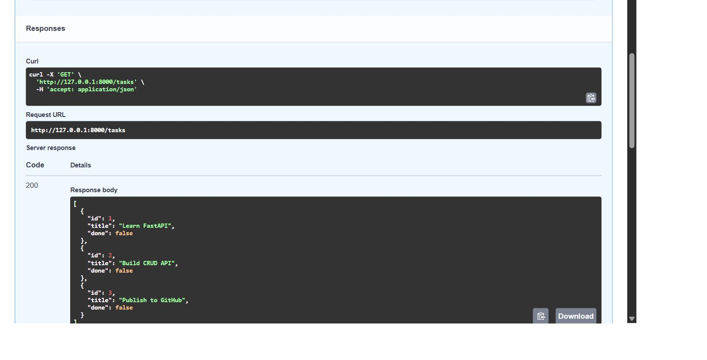

# Task API

A small CRUD API built with Python and FastAPI. It manages an in-memory to-do list and supports creating, reading, updating, and deleting tasks.

## Features

- Create new tasks
- List all tasks
- Get one task by ID
- Update a task
- Delete a task
- Validate request bodies
- Return appropriate HTTP status codes
- Interactive Swagger UI documentation

## Requirements

- Python 3.10 or newer
- Git

## Installation

Clone the repository:

```bash
git clone https://github.com/Ahsa6117/fastapi-task-api.git
cd task-api
```

Create a virtual environment:

```bash
python -m venv .venv
```

Activate it on Windows:

```powershell
.venv\Scripts\Activate.ps1
```

Install the dependencies:

```bash
pip install -r requirements.txt
```

## Run the API

```bash
fastapi dev main.py
```

The API will be available at:

```
http://127.0.0.1:8000
```

Swagger UI:

```
http://127.0.0.1:8000/docs
```

## Endpoints

| Method | Endpoint          | Description         | Success status |
| ------ | ----------------- | ------------------- | -------------- |
| GET    | /                 | Describe the API    | 200            |
| GET    | /health           | Check server health | 200            |
| GET    | /tasks            | List all tasks      | 200            |
| GET    | /tasks/{task_id}  | Get one task        | 200            |
| POST   | /tasks            | Create a task       | 201            |
| PUT    | /tasks/{task_id}  | Update a task       | 200            |
| DELETE | /tasks/{task_id}  | Delete a task       | 204            |

## Create a Task

Request:

```bash
curl -i -X POST http://127.0.0.1:8000/tasks \
  -H "Content-Type: application/json" \
  -d "{\"title\":\"Buy milk\"}"
```

Example response:

```
HTTP/1.1 201 Created
content-type: application/json

{
  "id": 4,
  "title": "Buy milk",
  "done": false
}
```

## Swagger UI



## Status Codes

| Status | Meaning                        |
| ------ | ------------------------------ |
| 200    | Request completed successfully |
| 201    | Task created successfully      |
| 204    | Task deleted successfully      |
| 400    | Invalid request body           |
| 404    | Task was not found             |

## In-Memory Storage

This project stores tasks in a Python list rather than a database. Any tasks created or updated while the server is running will be lost when the server restarts.

A database would provide permanent storage, which will be added in a later project.
