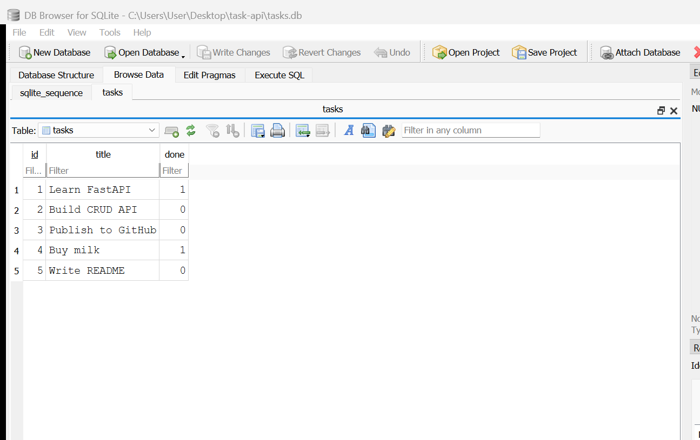

# Task API

A small CRUD API built with Python and FastAPI. It manages a to-do list stored in a **SQLite** database, so tasks survive a server restart.

This is Assignment 1's API with its storage layer swapped from an in-memory Python list to a real database. The endpoints, request bodies, responses, and status codes are all unchanged — only the code behind them changed.

## Features

- Create, read, update, and delete tasks
- Tasks stored in a SQLite database (`tasks.db`)
- Database file, table, and example tasks all created automatically on first run
- Every query is parameterized — no user input is ever glued into SQL text
- Search, filter, sort, and task statistics computed by the database
- Validate request bodies and return appropriate HTTP status codes
- Interactive Swagger UI documentation

## Why SQLite

- **It is one file.** The whole database is `tasks.db` sitting next to the code. Backing it up is copying a file.
- **Zero setup.** There is no database server to install, start, or configure, and no username or password. SQLite ships inside Python's standard library, so `import sqlite3` is the entire installation.
- **It survives restarts.** This is the point of the change. In Assignment 1 the tasks lived in a Python list inside the running process, so stopping the server erased them. Now they live on disk and are still there tomorrow.
- **It is a real database.** The same SQL used here — `SELECT`, `INSERT`, `UPDATE`, `DELETE`, `WHERE`, `COUNT` — is what a Postgres or MySQL project would use later. Moving to a bigger database would change the connection code, not the endpoints.

SQLite's limits show up when many servers need to write to the same data at once, which is when a client/server database like Postgres earns its extra setup. For a single-process API like this one, it is the right tool.

## Where the database lives

`tasks.db`, in the project root, created automatically the first time the server starts. Opening a SQLite file that does not exist creates it.

It is listed in `.gitignore` and is **not** committed, so every clone starts from a fresh database with the three example tasks. Deleting `tasks.db` and restarting is a clean reset.

On startup the app does three things, inside a single transaction:

1. creates the `tasks` table if it is missing,
2. creates an index on `title`,
3. counts the rows and inserts the three example tasks **only if the count is 0**.

That row count is what stops the examples from multiplying on every restart.

## Schema

| Column | Type | Notes |
| ------ | ---- | ----- |
| `id` | INTEGER | Primary key, assigned by the database |
| `title` | TEXT | Not null |
| `done` | INTEGER | `0` or `1`, defaults to `0`, returned as JSON `true`/`false` |

## Requirements

- Python 3.10 or newer
- Git

## Installation

Clone the repository:

```bash
git clone https://github.com/Ahsa6117/fastapi-task-api.git
cd fastapi-task-api
```

Create a virtual environment:

```bash
python -m venv .venv
```

Activate it on Windows:

```powershell
.venv\Scripts\Activate.ps1
```

Install the dependencies:

```bash
python -m pip install -r requirements.txt
```

## Run the API

One command, and the database creates itself:

```bash
fastapi dev main.py
```

The API will be available at:

```
http://127.0.0.1:8000
```

Swagger UI:

```
http://127.0.0.1:8000/docs
```

On a clean clone this creates `tasks.db`, creates the `tasks` table, seeds the three example tasks, and serves them at `GET /tasks`. No manual database setup.

## Endpoints

| Method | Endpoint          | Description         | Success status |
| ------ | ----------------- | ------------------- | -------------- |
| GET    | /                 | Describe the API    | 200            |
| GET    | /health           | Check server health | 200            |
| GET    | /tasks            | List all tasks      | 200            |
| GET    | /tasks/{task_id}  | Get one task        | 200            |
| GET    | /stats            | Count tasks         | 200            |
| POST   | /tasks            | Create a task       | 201            |
| PUT    | /tasks/{task_id}  | Update a task       | 200            |
| DELETE | /tasks/{task_id}  | Delete a task       | 204            |

### Query parameters on `GET /tasks`

| Parameter | Example | SQL behind it |
| --------- | ------- | ------------- |
| `search` | `/tasks?search=milk` | `WHERE title LIKE '%milk%'` |
| `done` | `/tasks?done=true` | `WHERE done = ?` |
| `sort` | `/tasks?sort=title` | `ORDER BY title COLLATE NOCASE` |

The filtering happens inside the database, not in a Python loop.

## Create a Task

Request:

```bash
curl -i -X POST http://127.0.0.1:8000/tasks \
  -H "Content-Type: application/json" \
  -d "{\"title\":\"Buy milk\"}"
```

Example response:

```
HTTP/1.1 201 Created
content-type: application/json

{
  "id": 4,
  "title": "Buy milk",
  "done": false
}
```

Stop the server, start it again, and `GET /tasks` still returns that task.

## Example SQL query

Run by hand against `tasks.db` while the server was running:

```sql
UPDATE tasks SET done = 1 WHERE id = 2;
```

It reported `1 row changed`, and `GET /tasks/2` immediately returned `{"id": 2, "title": "Build CRUD API", "done": true}` — with no restart, because the API and the SQL client read the exact same file. There is one source of truth, and no syncing step.

The full Stage 4 session, including `SELECT`, `COUNT(*)`, and `DELETE`, is in [docs/sql-exploration.md](docs/sql-exploration.md).

## Database screenshot

`tasks.db` open in DB Browser for SQLite:



These are the same five rows the API was serving at that moment:

```bash
curl -s http://127.0.0.1:8000/tasks
```

```json
[
  { "id": 1, "title": "Learn FastAPI",     "done": true  },
  { "id": 2, "title": "Build CRUD API",    "done": false },
  { "id": 3, "title": "Publish to GitHub", "done": false },
  { "id": 4, "title": "Buy milk",          "done": true  },
  { "id": 5, "title": "Write README",      "done": false }
]
```

Two things to notice. "Buy milk" and "Write README" were created through
`POST /tasks` and are still in the file after the server was restarted — that is
persistence, shown from both sides. And `done` is stored as `1`/`0` in the
table but returned as `true`/`false` in JSON, which is the storage layer doing
its job: the database's representation stays in the database.

## Parameterized queries

Every value that comes from a request is passed to SQLite as a `?` parameter, separately from the SQL text:

```python
connection.execute(
    "SELECT id, title, done FROM tasks WHERE id = ?",
    (task_id,),
)
```

The alternative — building the query with an f-string — would let a request's contents be read as SQL commands. Keeping data out of the SQL text makes that impossible.

## Testing

`smoke_test.py` contains the Assignment 1 endpoint checks, unchanged, run against the SQLite version:

```bash
python smoke_test.py
```

All 20 pass. That is the interesting part: the tests were written against a version that stored tasks in a Python list, and they still pass now that tasks live on disk. Tests describe what the API promises, and the promise did not change — where the data is kept is an implementation detail hidden behind the endpoints. The same tests would pass again if this moved to Postgres tomorrow.

## AI vs me

I built Stages 0–5 by hand, then asked an AI assistant to do the same
memory-to-SQLite migration and reviewed its work. Its code lives in
[`ai-version/`](ai-version/) and was never merged — the submission is hand-built.

Caveat worth stating: the same model wrote both sides, so this is a softer test
than using a different assistant. The AI version was generated from the prompt
alone, and every finding below came from running it.

### The prompt I gave it

> I have a FastAPI to-do API that keeps its tasks in a Python list in memory.
> Move the storage to SQLite using Python's built-in `sqlite3` module.
>
> - The database file should be called `tasks.db` and be created automatically
>   if it does not exist.
> - Create a table called `tasks` if it is missing, with columns: `id`
>   (integer, primary key, assigned by the database), `title` (text), and
>   `done` (boolean stored as 0 or 1).
> - Seed three example tasks, but only if the table is empty.
> - Keep the same five endpoints with the same behaviour: `GET /tasks`,
>   `GET /tasks/{id}`, `POST /tasks`, `PUT /tasks/{id}`, `DELETE /tasks/{id}`.
> - A missing or empty title returns 400. An unknown id returns 404. Creating
>   returns 201, deleting returns 204.
> - Use parameterized queries, never string formatting, for anything that
>   comes from a request.
>
> Give me the full file.

### It ran on the first try

It created the database, seeded exactly three tasks, did not re-seed on
restart, and data survived being stopped and started. The headline feature
worked. The differences are all in the details my prompt left open.

### What it did better

It used SQLite's **`RETURNING` clause** — `INSERT INTO tasks (...) VALUES (?, ?)
RETURNING id, title, done` — so the insert hands back the row that was actually
written. My version takes `cursor.lastrowid` and rebuilds the response from the
values I sent, which quietly *assumes* the stored row matches what I gave it. On
`UPDATE` it is a bigger win: `UPDATE ... RETURNING` returns nothing when no row
matched, which replaced my separate `SELECT`-then-`UPDATE` 404 check with one
statement.

### What it got wrong

1. **Error bodies changed shape** — `{"detail": "Task not found"}` instead of
   A1's `{"error": ...}`. The status code is right, so this passes a careless
   test and breaks every client.
2. **Invalid bodies returned 422**, FastAPI's default, not the required 400.
3. **`PUT` stopped being partial** — `{"done": true}` returned 422, because it
   typed the body as requiring both fields.
4. **A whitespace-only title returned 201** and stored a blank task. It never
   stripped the string.
5. **`DB_PATH = "tasks.db"` is relative to the working directory.** Starting the
   app from another folder created a second, empty, freshly seeded database —
   which to a user looks exactly like losing all their data. This is the one I
   would call a genuine bug.
6. **One shared connection** with `check_same_thread=False`, shared across
   FastAPI's thread pool — a real trade-off, decided silently.
7. **No `ORDER BY`**, so row order is whatever SQLite finds convenient.

### What my prompt forgot

All seven trace back to the prompt, not to the model. I described the *schema*
precisely and the *behaviour* in slogans — "keep the same endpoints", "same
behaviour". The schema came back perfect; the behaviour came back as the model's
best guess. "Same as before" means nothing to something that cannot see the
before.

I found all seven in about ten minutes only because I had already made all seven
decisions myself over the previous five stages. I was not checking the output
against the prompt — I was checking it against a version I understood.

### The rematch

Prompt v2 stated all seven explicitly. Every difference disappeared, and the
regenerated version passes all 20 checks in `smoke_test.py` **unmodified** —
which v1 could not even be run against, since it had no separate storage module
to point the tests at. It kept the `RETURNING` improvement, so v2 is better than
my hand-built version rather than a copy of it.

Full write-up, prompts, and the diff: [docs/ai-vs-me.md](docs/ai-vs-me.md).

## Status Codes

| Status | Meaning                        |
| ------ | ------------------------------ |
| 200    | Request completed successfully |
| 201    | Task created successfully      |
| 204    | Task deleted successfully      |
| 400    | Invalid request body           |
| 404    | Task was not found             |

## Project structure

```
main.py          FastAPI app and the endpoints
db.py            the storage layer: every SQL query lives here
smoke_test.py    the Assignment 1 endpoint checks
docs/            Stage 4 SQL exploration notes
tasks.db         the database (created automatically, not committed)
```

The endpoints in `main.py` never write SQL themselves. They call functions in `db.py`, which is what made this migration a change to one file rather than a rewrite.

## Notes on the index and the transaction

- **The index.** `CREATE INDEX idx_tasks_title ON tasks (title)` gives the database a sorted lookup structure for `title`, so a search or an alphabetical sort can find rows without scanning every one. It costs a little extra work on every write in exchange for much faster reads.
- **The transaction.** Startup wraps table creation, index creation, and seeding in one transaction, so all of it happens or none of it does. Without that, a crash halfway through seeding could leave the table with one or two example tasks and no way to tell that the seed was incomplete.
