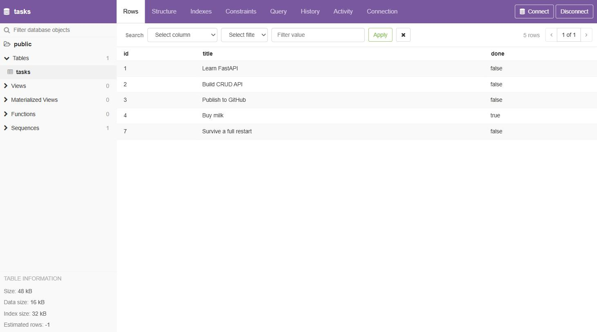

# Task API

A small CRUD API built with Python and FastAPI. It manages a to-do list stored in **PostgreSQL**, and the whole stack — the app and its database — starts with one command:

```bash
cp .env.example .env
docker compose up
```

That is the entire setup. No Postgres install, no `createdb`, no schema script. The API is at `http://localhost:3000`.

This is Assignment 1's API with its storage swapped for the third time. The endpoints, request bodies, responses, and status codes have never changed:

| Assignment | Where tasks live | What runs it |
| ---------- | ---------------- | ------------ |
| A1 | a Python list in memory | the app process — gone on restart |
| A2 | a `tasks.db` file | SQLite, on disk |
| **A3 (this)** | rows in a `tasks` table | **PostgreSQL, in a container** |

Three storage engines, one API contract. `smoke_test.py` still contains the Assignment 1 checks, unmodified, and all 24 pass against Postgres — see [Testing](#testing).

## Features

- Create, read, update, and delete tasks
- Tasks stored in PostgreSQL, running as a container
- Table and example tasks created automatically on first run
- Every query is parameterized — no user input is ever glued into SQL text
- The database password comes from a git-ignored `.env`, never from code
- A named volume keeps the data across a full `docker compose down` / `up`
- `/health` pings the database and returns 503 when it cannot answer
- Search, filter, sort, and task statistics computed by the database
- Interactive Swagger UI documentation

## Why Postgres, and why in a container

- **It is a server, not a file.** SQLite was one file that one process opened. Postgres is its own program that many app instances connect to over the network — which is the only way to scale past a single server. This is the engine behind a large share of real backends.
- **You do not install it.** `docker compose up` downloads the official `postgres` image and runs it. There is no version to match, no service to configure, and removing it is `docker compose down -v`. That is what kills "works on my machine".
- **Richer types.** `done` is a real `boolean` here. SQLite had no boolean type, so A2 stored `0`/`1` integers and converted them on the way out.
- **The data is not in the container.** Containers are disposable; the named `taskdata` volume is not. Delete and recreate the database container and the rows are still there — see [Persistence](#persistence).

## Requirements

- Docker (Docker Desktop, Podman, or Docker Engine) — that is all you need for the one-command route
- Python 3.10+ and Git, only if you want to run the app outside a container

## Run it

### The one command

```bash
git clone https://github.com/Ahsa6117/fastapi-task-api.git
cd fastapi-task-api
cp .env.example .env      # then edit it and set a real password
docker compose up
```

| URL | What it is |
| --- | ---------- |
| `http://localhost:3000` | the API |
| `http://localhost:3000/docs` | Swagger UI |
| `localhost:5432` | Postgres, for psql or a GUI client |

On a clean clone this builds the app image, starts Postgres, waits for it to be ready, creates the `tasks` table, seeds the three example tasks, and serves them at `GET /tasks`. No manual database setup.

That round-trip is tested, not assumed: this repo was cloned fresh from GitHub into an empty directory, `cp .env.example .env` run with the placeholder values left exactly as committed, and `docker compose up` issued. The API answered 3 seconds after the build with the three seeded tasks, `POST`/`PUT`/`DELETE`/404 all returned the right codes, and the rows were visible from `psql` — on a machine with no Postgres installed.

To stop: `Ctrl+C`, then `docker compose down`. Add `-v` to also delete the volume and the data.

### Configuration

Everything the stack needs is in `.env`, which is git-ignored. `.env.example` is committed as the template:

| Variable | What it is |
| -------- | ---------- |
| `DATABASE_URL` | how the app reaches Postgres. Used when you run the app directly on your machine; compose overrides it with host `db`. |
| `POSTGRES_PASSWORD` | the password Postgres is created with, and the one substituted into compose |
| `POSTGRES_DB` | the database name (`tasks`) |

**No password appears in any committed file** — not in `db.py`, not in `compose.yaml` (which uses `${POSTGRES_PASSWORD}` substitution), and not in the image (`.dockerignore` excludes `.env`).

### Running the app outside a container

Useful while developing, since you get reload on save. Start only the database:

```bash
docker compose up -d db
.venv\Scripts\Activate.ps1
python -m pip install -r requirements.txt
fastapi dev main.py
```

`DATABASE_URL` in `.env` already points at `localhost:5432`, so this works with no further changes.

### The database on its own, without compose

The Stage 0 command, kept here because it is the shortest way to get a real database:

```bash
docker run --name taskdb \
  -e POSTGRES_PASSWORD=dev -e POSTGRES_DB=tasks \
  -p 5432:5432 -v taskdata:/var/lib/postgresql/data \
  -d postgres:16
```

Reading it: run the official `postgres` image; name the container `taskdb`; set the password and create a database called `tasks`; map the container's port 5432 to yours; mount a named volume so the data outlives the container; `-d` runs it in the background.

> **Pin the version — `postgres` alone will not work.** Written as `-d postgres`,
> this pulls Postgres 18+, which **moved its data directory**. Mounting a volume
> at `/var/lib/postgresql/data` now makes the container exit immediately with
> `"there appears to be PostgreSQL data in /var/lib/postgresql/data (unused
> mount/volume)"` — 18 expects the mount one level up, at `/var/lib/postgresql`.
> I hit this on the first run. `compose.yaml` pins `postgres:16` for the same
> reason, and the two must match: a volume written by 18 cannot be read by 16,
> so switching versions on an existing volume fails again with a different
> error. `docker volume rm taskdata` is the reset.
>
> This is the general lesson about `latest`, arriving early and cheaply: it is
> not a version, it is "whatever changed while you were not looking."

Open a SQL prompt inside it:

```bash
docker exec -it taskdb psql -U postgres -d tasks
```

## Endpoints

| Method | Endpoint | Description | Success status |
| ------ | -------- | ----------- | -------------- |
| GET    | `/` | Describe the API | 200 |
| GET    | `/health` | Check the server **and the database** | 200 / 503 |
| GET    | `/tasks` | List all tasks | 200 |
| GET    | `/tasks/{task_id}` | Get one task | 200 |
| GET    | `/stats` | Count tasks | 200 |
| POST   | `/tasks` | Create a task | 201 |
| PUT    | `/tasks/{task_id}` | Update a task | 200 |
| DELETE | `/tasks/{task_id}` | Delete a task | 204 |

### Query parameters on `GET /tasks`

| Parameter | Example | SQL behind it |
| --------- | ------- | ------------- |
| `search` | `/tasks?search=milk` | `WHERE title ILIKE %s` |
| `done` | `/tasks?done=true` | `WHERE done = %s` |
| `sort` | `/tasks?sort=title` | `ORDER BY lower(title)` |

The filtering happens inside the database, not in a Python loop.

### Status codes

| Status | Meaning |
| ------ | ------- |
| 200 | Request completed successfully |
| 201 | Task created successfully |
| 204 | Task deleted successfully |
| 400 | Invalid request body |
| 404 | Task was not found |
| 503 | The app is up but the database is not answering |

Every error response is `{"error": "<message>"}`.

## The full cycle with `curl -i`

Create:

```bash
curl -i -X POST http://localhost:3000/tasks \
  -H "Content-Type: application/json" \
  -d "{\"title\":\"Buy milk\"}"
```

```
HTTP/1.1 201 Created
content-type: application/json

{"id":4,"title":"Buy milk","done":false}
```

Mark it done:

```bash
curl -i -X PUT http://localhost:3000/tasks/4 \
  -H "Content-Type: application/json" \
  -d "{\"done\":true}"
```

```
HTTP/1.1 200 OK
content-type: application/json

{"id":4,"title":"Buy milk","done":true}
```

Delete it:

```bash
curl -i -X DELETE http://localhost:3000/tasks/4
```

```
HTTP/1.1 204 No Content
```

An unknown id:

```bash
curl -i http://localhost:3000/tasks/999
```

```
HTTP/1.1 404 Not Found
content-type: application/json

{"error":"Task 999 not found"}
```

## Persistence

The point of the named volume. Create a task, tear the whole stack down, bring it back:

```bash
curl -X POST http://localhost:3000/tasks -H "Content-Type: application/json" -d "{\"title\":\"Survive a restart\"}"
docker compose down
docker compose up -d
curl -s http://localhost:3000/tasks
```

"Survive a restart" is still there, and the seed does not run again — because the table is not empty.

The container was destroyed and rebuilt; the volume was not. The rows live in `taskdata`, mounted at `/var/lib/postgresql/data` inside the container. Run the same experiment with the `volumes:` line removed and the data is gone every time, which is the whole reason volumes exist: **a container's own filesystem dies with the container.**

`docker compose down -v` deletes the volume too, and is how you get a genuinely clean start.

## Schema

```sql
CREATE TABLE IF NOT EXISTS tasks (
    id    serial  PRIMARY KEY,
    title text    NOT NULL,
    done  boolean NOT NULL DEFAULT false
);
```

| Column | Type | Notes |
| ------ | ---- | ----- |
| `id` | `serial` | Primary key. `serial` means Postgres assigns and increments it. |
| `title` | `text` | Not null |
| `done` | `boolean` | Defaults to `false`. A real boolean — SQLite had to fake this with `0`/`1`. |

## What happens on startup

`db.init_db()` runs once, from the FastAPI lifespan hook:

1. **Wait for the server.** Retries the first connection for up to 30 seconds. `depends_on` waits for the *container*, but Postgres needs a few more seconds inside it before it accepts clients, so the app has to be patient itself.
2. **Create the table** if it is missing.
3. **Create an index** on `title`.
4. **Count the rows, and insert the three example tasks only if the count is 0.**

Steps 2–4 are one transaction: all of it happens or none of it does, so a crash mid-seed can never leave one and a half example tasks behind. Step 4's row count is what stops the examples from multiplying on every restart.

## Looking inside the database

`psql` is the SQL prompt that ships inside the Postgres image, so there is
nothing to install to use it:

```bash
docker compose exec db psql -U postgres -d tasks
```

```sql
\dt                        -- list the tables
SELECT * FROM tasks;       -- the same rows GET /tasks is serving
\q
```

A GUI client works too — DBeaver, pgAdmin, and TablePlus all connect to
`localhost:5432` with the user, password, and database from your `.env`, because
the `db` service publishes that port. The screenshot below uses
[pgweb](https://github.com/sosedoff/pgweb), which is itself a container:

```bash
docker run --name pgweb --network task-api_default -p 8081:8081 \
  -e PGWEB_DATABASE_URL="postgres://postgres:YOUR_PASSWORD@db:5432/tasks?sslmode=disable" \
  -d sosedoff/pgweb
```



Read the rows carefully, because they are the assignment's two claims in one
picture. **`Buy milk` is `true`** — that is a `PUT` that went all the way to
disk. **`Survive a full restart` is there at all** — it was created, then
`docker compose down` destroyed both containers, then `up` rebuilt them, and the
row came back from the `taskdata` volume. And the ids jump from 4 to 7, because
5 and 6 were deleted: `serial` never reuses a number, which is exactly what you
want from a primary key.

The same rows from psql, at the same moment:

```
$ docker compose exec db psql -U postgres -d tasks -c 'SELECT * FROM tasks ORDER BY id;'

 id |         title          | done
----+------------------------+------
  1 | Learn FastAPI          | f
  2 | Build CRUD API         | f
  3 | Publish to GitHub      | f
  4 | Buy milk               | t
  7 | Survive a full restart | f
(5 rows)
```

The A2 screenshot of the previous SQLite database is at
[images/db-browser.png](images/db-browser.png), for comparison.

## Parameterized queries

Every value that comes from a request is passed to Postgres as a `%s` parameter, separately from the SQL text:

```python
connection.execute(
    "SELECT id, title, done FROM tasks WHERE id = %s",
    (task_id,),
)
```

The alternative — building the query with an f-string — would let a request's contents be read as SQL commands. Keeping data out of the SQL text makes that impossible. `smoke_test.py` proves it by creating a task titled `'); DROP TABLE tasks; --` and then checking the table is still there.

The placeholder changed from SQLite's `?` to psycopg's `%s`, but the idea is identical: the value travels beside the query, never inside it.

## The health check

```bash
curl -s http://localhost:3000/health
```

```json
{"status": "ok", "db": "ok"}
```

It runs `SELECT 1` — the cheapest query there is, touching no tables — and returns **503** with `"db": "down"` if that fails. An app that is running but cannot reach its database is not healthy; it will fail every real request.

That distinction is what a **load balancer** uses. A load balancer sits in front of several copies of an app and spreads incoming requests across them. It polls each copy's health endpoint every few seconds, and the moment one stops returning 200 it stops sending it traffic — the broken instance is pulled out of rotation automatically, without a human noticing first. Which is exactly why the endpoint must check the database and not just answer "I'm alive".

## Testing

`smoke_test.py` contains the Assignment 1 endpoint checks — the same requests, the same expected responses — now run against Postgres:

```bash
docker compose up -d db
python smoke_test.py
```

It creates a throwaway `tasks_test` database, so your real tasks are never touched.

```
All 24 checks passed.
```

They pass unchanged. That is the interesting part, and it is now true across **three** storage engines: a Python list, a SQLite file, and a Postgres server. The tests describe what the API promises — these five URLs, these shapes, these status codes — and the promise never depended on where the bytes were kept.

This is why storage is called "just an implementation detail". Not because it is unimportant (Postgres vs a list is an enormous difference in durability and scale), but because it is *invisible from outside*. Every client written against A1 still works against A3 without changing a line. The only file that was rewritten each time is `db.py`.

The reason that separation held is that it was drawn deliberately from the start: `main.py` contains routes and validation, `db.py` contains every line of SQL, and neither reaches into the other. Assignment A15 — Layered architecture — formalizes exactly this split into named layers with explicit boundaries. This repo has been an informal version of it for three assignments, and this migration is what it buys you: swapping the entire database engine touched one file and no endpoint.

## AI vs me

The Assignment A3 rematch — my prompt, the AI's containerized stack, and what running it revealed — is in **[docs/a3-ai-vs-me.md](docs/a3-ai-vs-me.md)**, with the prompts in [docs/a3-ai-prompt.md](docs/a3-ai-prompt.md) and the generated code quarantined in [`ai-version/a3/`](ai-version/a3/). None of it is merged; the submission is hand-built.

The A2 round (memory → SQLite) is in [docs/ai-vs-me.md](docs/ai-vs-me.md).

## Project structure

```
main.py            FastAPI app and the endpoints — no SQL
db.py              the storage layer: every SQL query lives here
smoke_test.py      the Assignment 1 endpoint checks
compose.yaml       the whole stack: api + db, one command
Dockerfile         two-stage build for the app's image
requirements.txt   dependencies for developing (includes the fastapi CLI)
requirements-runtime.txt   the shorter list the container actually needs
.env.example       the config template (.env itself is git-ignored)
.dockerignore      keeps .env and friends out of the image
scripts/           one-time Docker setup helper for WSL
docs/              SQL notes and the AI comparisons
ai-version/        AI-generated versions, quarantined, never merged
images/            screenshots
```

The endpoints in `main.py` never write SQL themselves. They call functions in `db.py`, which is what made this migration a change to one file rather than a rewrite — for the second time.

## The multi-stage Dockerfile, and the measurement that went wrong first

The app image is built in two stages: a **builder** that installs the
dependencies into a virtualenv, and a runtime stage that starts clean and copies
only that finished virtualenv across. Docker keeps only the final stage, so
everything used to *build* the image is discarded.

| | Uncompressed | Compressed |
| --- | --- | --- |
| Before — single stage, `fastapi[standard]` | **318 MB** | 74.3 MB |
| Naive multi-stage, same dependencies | 322 MB | 74.8 MB |
| After — multi-stage, runtime deps only, no pip | **259 MB** | 61.1 MB |

**The middle row is the interesting one: multi-stage on its own made the image
slightly bigger.** I expected a win and measured a loss. Two reasons, both
obvious in hindsight:

1. **There was no build toolchain to throw away.** Multi-stage pays off when a
   package compiles from source and drags in gcc and headers. Every dependency
   here — including `psycopg[binary]`, whose whole point is the name — ships as
   a prebuilt wheel. The builder stage had nothing heavy to leave behind.
2. **`python -m venv` installs its own pip**, so pip shipped anyway, just at a
   different path.

What actually shrank it was deciding what the *running server* needs:

- **`fastapi[standard]` → plain `fastapi` + `uvicorn[standard]`.** The
  `[standard]` extra pulls the whole development kit — the `fastapi` CLI, rich,
  typer, httpx, jinja2, email-validator, python-multipart. Useful at a terminal,
  dead weight in a container whose only job is `uvicorn main:app`. That is what
  `requirements-runtime.txt` is: `requirements.txt` stays as-is for development,
  because `smoke_test.py` genuinely needs httpx for `TestClient`.
- **Deleting pip, setuptools and wheel from the venv** before it is copied. A
  running app never installs anything.

Verified after slimming: `docker compose up -d --build` still comes up in 3
seconds, all 24 smoke-test checks pass, persistence still holds, and `/app`
contains exactly `main.py` and `db.py` — no `.env`.

The lesson is not "multi-stage builds don't work." It is that **the size was
never in the build tooling, it was in the dependency list**, and I would have
kept believing otherwise if I had shipped the change without measuring it.

## Notes

- **The index.** `CREATE INDEX idx_tasks_title ON tasks (title)` gives the database a sorted lookup structure for `title`, so a search or an alphabetical sort can find rows without scanning every one. It costs a little extra work on every write in exchange for much faster reads.
- **`db`, not `localhost`.** Inside the compose network the app reaches the database at the hostname `db` — the service name. A container's `localhost` is *itself*, so `localhost:5432` from the api container would find nothing. This is the single most common mistake in a first compose file.
- **The healthcheck.** `depends_on` alone only waits for the db container to *start*. The `pg_isready` healthcheck plus `condition: service_healthy` makes compose wait until Postgres actually accepts connections, and the retry loop in `db.py` covers the case where you run the app outside compose.
