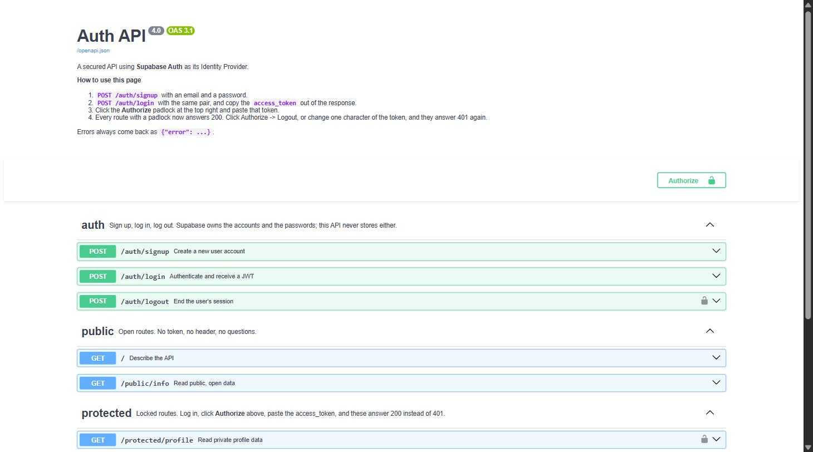
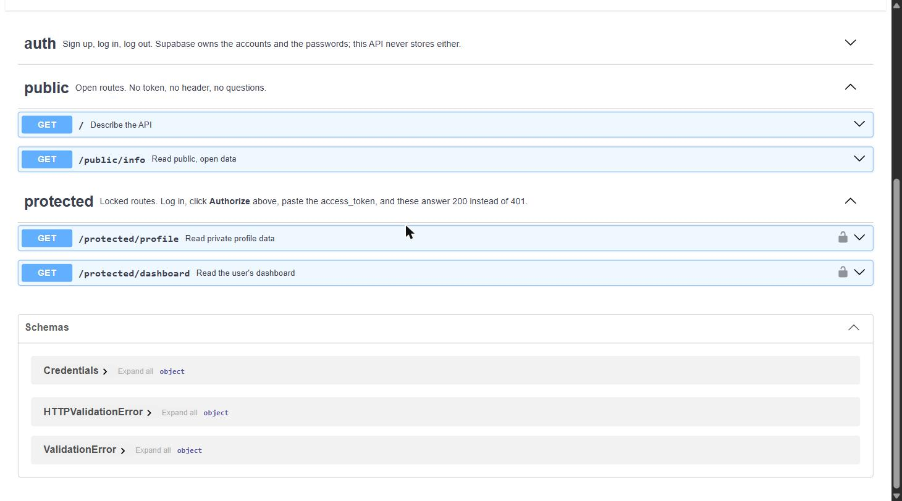

# Auth API — sign up, log in, protect

Assignment A4. A FastAPI service that hands account management to **Supabase Auth**, then verifies the tokens Supabase issues in order to guard its own routes.

It lives in `auth/` inside this repo. The A1–A3 Task API in the repo root is untouched and still runs.

```bash
cp .env.example .env          # then paste your Supabase URL and anon key
uvicorn auth.main:app --reload --port 8000
```

Swagger UI: <http://localhost:8000/docs>

## The one idea

Three parties, and nobody trusts a password sitting on a server:

| Step | Who | What happens |
| ---- | --- | ------------ |
| 1 | client → this API → Supabase | email and password go to Supabase |
| 2 | Supabase → client | Supabase checks them and returns a signed **JWT** |
| 3 | client → this API | the JWT comes back as `Authorization: Bearer <token>` |
| 4 | this API → Supabase | `get_user(token)` asks whether the token is genuine |

Step 4 is the only thing that decides whether a door opens.

**This project never stores a password and never hashes anything itself.** Supabase owns the accounts, the hashing, and the signing keys. Rolling your own is how security incidents happen — and there is nothing here to roll.

## Endpoints

| Method | Route | What it does | Auth header | Success |
| ------ | ----- | ------------ | ----------- | ------- |
| `POST` | `/auth/signup` | Create a user account | none | `201` |
| `POST` | `/auth/login` | Authenticate, return a JWT | none | `200` |
| `POST` | `/auth/logout` | Revoke the session | `Bearer <token>` | `204` |
| `GET` | `/protected/profile` | Read private profile data | `Bearer <token>` | `200` |
| `GET` | `/protected/dashboard` | A second locked route, same guard | `Bearer <token>` | `200` |
| `GET` | `/protected/admin` | Admin-only data | `Bearer <token>` | `200` |
| `POST` | `/auth/refresh` | Trade a refresh token for a new access token | none | `200` |
| `GET` | `/public/info` | Open data | none | `200` |
| `GET` | `/` | Describe the API | none | `200` |

Failures always come back as `{"error": "..."}`:

| Status | When |
| ------ | ---- |
| `400` | email or password missing or blank; Supabase refused the signup |
| `401` | no token, malformed header, or a token that is invalid or expired |
| `403` | a valid token, from a user who is not an admin |
| `503` | Supabase could not be reached |

## Setup

**1. Create a Supabase project.** Free, no card, at [supabase.com](https://supabase.com). It takes a minute to provision.

**2. Copy two values** from Project Settings → API:

- the **Project URL**
- the **anon** key — the public one

Do not use the `service_role` key. It bypasses every security rule Supabase has, and this project has no use for it.

**3. Turn off email confirmation** for local practice: Authentication → Sign In / Providers → Email → uncheck *Confirm email*. Without this a fresh signup cannot log in until the address is confirmed, and the checkpoints below stall at step two. In production you leave it on — confirmation is a real security control.

**4. Fill in `.env`** (already git-ignored; `.env.example` is the committed template):

```
SUPABASE_URL=https://YOUR_PROJECT_REF.supabase.co
SUPABASE_KEY=YOUR_SUPABASE_ANON_KEY
PORT=8000
```

**5. Install and run:**

```bash
pip install -r requirements.txt
uvicorn auth.main:app --reload --port 8000
```

The server prints `Server running and connected to Supabase at https://...`. If either variable is missing it refuses to start and says which one — a clear crash before the first request beats a 500 during somebody's first login.

## The full cycle with `curl -i`

```bash
# 1. Register. -> 201
curl -i -X POST http://localhost:8000/auth/signup \
  -H "Content-Type: application/json" \
  -d '{"email":"test@example.com","password":"password123"}'

# 2. Missing password. -> 400 {"error":"Password is required"}
curl -i -X POST http://localhost:8000/auth/signup \
  -H "Content-Type: application/json" \
  -d '{"email":"test@example.com"}'

# 3. Log in and copy the access_token. -> 200
curl -i -X POST http://localhost:8000/auth/login \
  -H "Content-Type: application/json" \
  -d '{"email":"test@example.com","password":"password123"}'

# 4. The lobby, open to anyone. -> 200
curl -i http://localhost:8000/public/info

# 5. The locked door, with no key. -> 401 {"error":"Access token required"}
curl -i http://localhost:8000/protected/profile

# 6. The locked door, with the real key. -> 200 and your user details
curl -i http://localhost:8000/protected/profile \
  -H "Authorization: Bearer <PASTE_ACCESS_TOKEN>"

# 7. Change one character of the token. -> 401 {"error":"Invalid or expired token"}
curl -i http://localhost:8000/protected/profile \
  -H "Authorization: Bearer <PASTE_A_TAMPERED_TOKEN>"

# 8. A second protected route, guarded by the same dependency. -> 200
curl -i http://localhost:8000/protected/dashboard \
  -H "Authorization: Bearer <PASTE_ACCESS_TOKEN>"

# 9. Log out. -> 204, no body
curl -i -X POST http://localhost:8000/auth/logout \
  -H "Authorization: Bearer <PASTE_ACCESS_TOKEN>"
```

Step 7 is the one worth pausing on. A JWT carries its own signature; change any character and it no longer matches. Supabase — the only party holding the signing key — is what notices.

## Swagger UI

`/docs` is generated from the code, not written by hand.



Click **Authorize**, paste an `access_token` from step 3, and every padlocked route answers `200` from the browser. Click Authorize → Logout and they answer `401` again.



The padlock appears on exactly the routes the guard protects — and not because a list somewhere says so. `HTTPBearer` is declared as a FastAPI dependency, so the routes that depend on it are the routes marked locked in the schema. The docs cannot drift away from the code, because they are derived from it.

## The guard

`auth/security.py` holds the whole security decision, once:

```python
@app.get("/protected/dashboard")
def protected_dashboard(user: dict = Depends(get_current_user)):
    ...
```

That is the entire auth code of a protected route. `Depends()` is FastAPI's middleware for a route — it runs before the handler, can stop the request early, and injects its result. A route either depends on the guard or it does not; there is no half-applied state and no check to forget to paste in.

Four decisions inside it that are easy to get wrong:

**`HTTPBearer(auto_error=False)`.** At its default, `HTTPBearer` answers a missing header itself — with `403` and FastAPI's own `{"detail": ...}` body. Neither matches what this API promises, so the guard owns every failure instead.

**The result is checked, not just the exception.** Some SDK versions answer with an empty user rather than raising. Code that only wraps `get_user` in `try/except` sails past that with `user = None` and treats a stranger as logged in.

**Failures do not explain themselves.** Expired, tampered, revoked, and never-issued all answer `Invalid or expired token`. A wrong login always answers `Invalid login credentials`, never "no such user" — the precise version tells an attacker which addresses have accounts.

**The token never travels back out.** The guard keeps the caller's token on the user dict so `logout` can act on their session; responses are trimmed to `id`, `email`, `created_at` before they leave.

## What logout can and cannot do

`POST /auth/logout` revokes the session at Supabase, so the refresh token is dead and the session cannot be extended.

It does **not** stop the access token verifying. A JWT is stateless — it is valid because of its signature, not because a server keeps a list, so nothing can un-issue it before it expires. That is exactly why access tokens are short-lived (an hour, by Supabase's default). "Instant logout" is genuinely hard with stateless tokens, and pretending otherwise is how people end up trusting a token that should have been dead.

## 401 vs 403

`/protected/admin` exists to make the difference concrete.

- **401 Unauthorized** — *"I do not know who you are."* No token, a malformed header, an expired or tampered token.
- **403 Forbidden** — *"I know exactly who you are, and you still may not."* A perfectly valid token belonging to a user without the admin role.

Sending 401 in the second case is a real bug, not a style choice: a client that gets 401 will sensibly try logging in again, and it will keep doing that forever, because logging in was never the problem.

The role is read from Supabase's `app_metadata`, which only the server can write. `user_metadata` is writable by the user, so a role trusted from there is a role anyone can grant themselves at signup. Make an admin from the dashboard: Authentication → Users → the user → `app_metadata` → `{"role": "admin"}`.

## Why access tokens expire, and what refresh is for

Access tokens last an hour. Short-lived is the entire point: a stolen JWT cannot be revoked — it is valid because of its signature, not because a server keeps a list — so the only thing limiting the damage is how soon it dies.

That would mean logging in every hour, which is what `POST /auth/refresh` prevents. The refresh token is long-lived but *can* be revoked (that is what logout does), so it is the one that gets to hold a session open.

## Testing

```bash
python -m auth.smoke_test
```

The assignment's checkpoints as one script: signup → login → a real token opens both protected routes → a tampered token is refused → logout. It runs against the real Supabase project in your `.env`, because a rejection is only convincing when something real does the rejecting. Each run signs up a throwaway `smoke-<random>@example.com`, so no account you care about is touched; clear them out from Authentication → Users when they accumulate.

## Project structure

```
auth/
  main.py             the routes, the error shapes, the Swagger config
  security.py         the guard — one dependency, applied to every locked route
  supabase_client.py  the only module that talks to Supabase
  smoke_test.py       every checkpoint in the assignment, in one run
```

`main.py` never verifies a token itself, and `security.py` never builds a Supabase client itself. Each file has one job, which is why adding the second protected route took one line and no new auth code.

## Secrets

`.env` is git-ignored and has never been committed — check with `git log --all -- .env` (no output means it never entered history). `.env.example` carries the key names with placeholder values, so a stranger can clone this and know exactly what to set without seeing anything real.

The `service_role` key appears nowhere in this project, by design.
